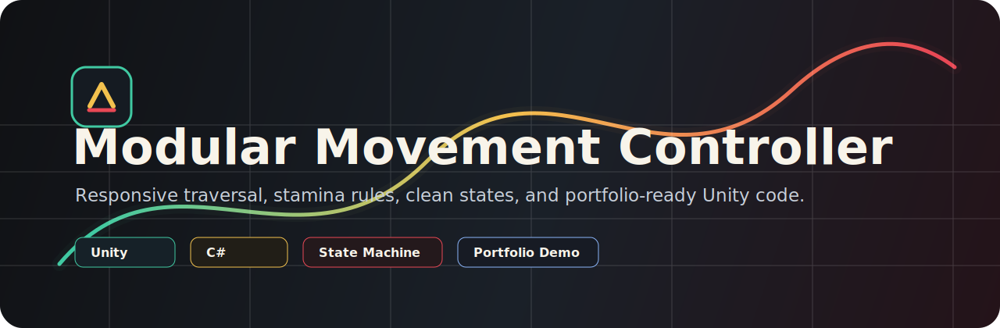
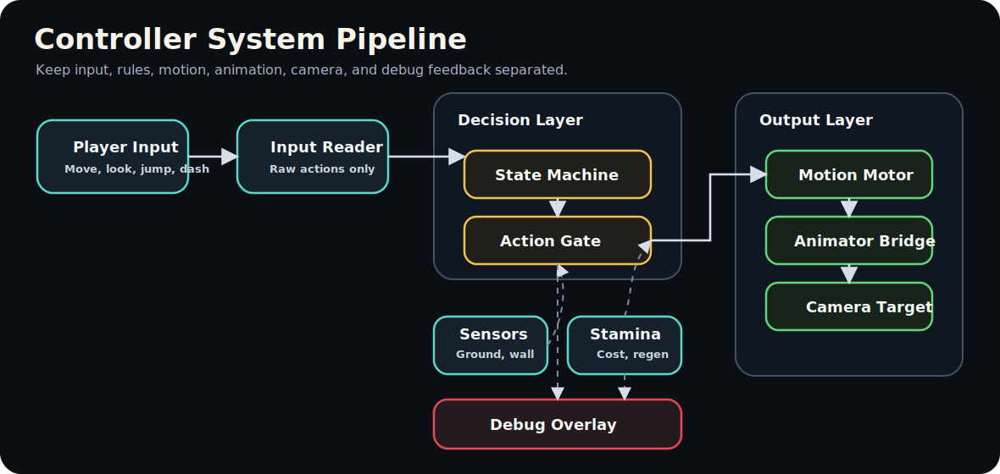
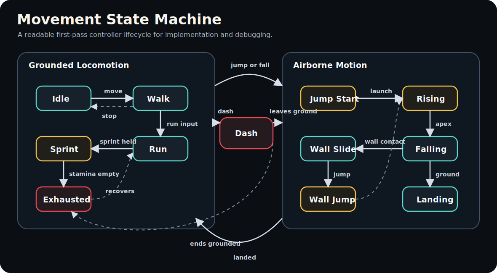
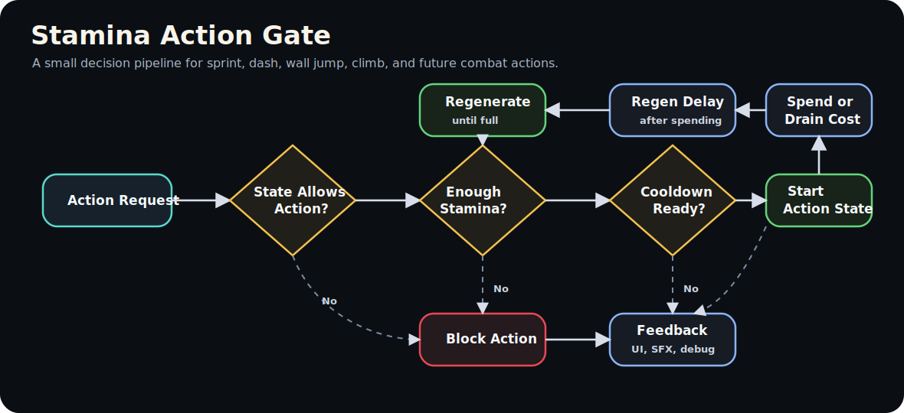

<p align="center">
  
</p>

<p align="center">
  
  
  
  
  
</p>

<h1 align="center">Modular Movement Controller</h1>

<p align="center">
  A Unity gameplay programming prototype focused on responsive third-person movement, stamina-based traversal, clean state architecture, and portfolio-ready technical presentation.
</p>

---

## Project Snapshot

The Modular Movement Controller is a focused Unity prototype designed to show how player movement can be structured for real gameplay use. It is not meant to be a full game. It is a technical showcase for how input, physics rules, state transitions, stamina costs, animation parameters, camera behavior, and debug tools can work together in a clean controller foundation.

This project is built around one question:

> Can the controller feel responsive, readable, expandable, and professional enough to belong in a portfolio?

## Core Goals

| Goal | What It Proves |
| --- | --- |
| Responsive movement | Input handling, acceleration, deceleration, rotation smoothing, and player feel |
| Modular states | Clear gameplay architecture that separates movement behavior into readable pieces |
| Stamina-based traversal | Resource checks, action costs, regen delay, blocked actions, and UI feedback |
| Debug visibility | Ground checks, wall checks, state display, velocity display, and tuning support |
| Portfolio polish | Clean documentation, demo scene, visuals, screenshots, and technical breakdown |

## Planned Feature Set

### Ground Movement

- Idle, walk, run, and sprint movement states
- Camera-relative movement direction
- Smooth acceleration and deceleration
- Rotation smoothing toward movement direction
- Slope detection and grounded correction
- Optional movement modifiers for future buffs, debuffs, or terrain effects

### Jumping and Air Control

- Jump start, rising, falling, and landing behavior
- Coyote time for more forgiving jumps
- Jump buffering before landing
- Tunable air control separate from grounded movement
- Landing feedback for animation, camera shake, and debug display

### Stamina Traversal

- Sprint drains stamina over time
- Dash spends stamina instantly
- Stamina regeneration waits after spending
- Actions are blocked when stamina is too low
- UI and debug feedback communicate current stamina and blocked actions

### Advanced Traversal

- Dash or dodge with cooldown and stamina cost
- Wall slide and wall jump foundation
- Future expansion paths for vaulting, climbing, gliding, swimming, lock-on, and combat integration

## System Architecture

<p align="center">
  
</p>

The controller is designed so each system has a narrow job:

| Layer | Responsibility |
| --- | --- |
| Input Reader | Reads Unity Input System actions and exposes clean input values |
| Sensors | Reports grounded state, slope data, wall contact, and environment checks |
| State Machine | Owns the current movement state and state transitions |
| Action Gate | Checks whether actions are allowed based on state, stamina, and cooldowns |
| Movement Motor | Applies velocity, gravity, acceleration, rotation, and movement output |
| Animator Bridge | Converts gameplay state into Animator parameters |
| Camera Target | Provides stable follow targets and camera feedback hooks |
| Debug Overlay | Shows state, stamina, velocity, grounded status, and sensor data |

## Movement State Machine

<p align="center">
  
</p>

The movement state machine keeps rules readable by giving each major movement mode its own behavior. States should decide what they are allowed to do, when they can transition, and which movement values they control.

### Starting State List

| State | Purpose | Common Transitions |
| --- | --- | --- |
| Idle | No movement input while grounded | Walk, Jump, Fall |
| Walk | Movement input at normal speed | Idle, Run, Sprint, Jump, Fall |
| Run | Faster grounded movement without full sprint cost | Walk, Sprint, Jump, Fall |
| Sprint | High-speed movement that drains stamina | Run, Walk, Jump, Fall, Exhausted |
| Exhausted | Temporary state when stamina is depleted | Run, Walk, Idle |
| Jump Start | Initial jump action and vertical launch | Rising, Fall |
| Rising | Player is moving upward after jump | Falling |
| Falling | Player is airborne and descending | Landing, Dash, Wall Slide |
| Dash | Short burst movement with stamina cost | Grounded, Airborne |
| Wall Slide | Player is contacting a valid wall while airborne | Wall Jump, Fall |
| Wall Jump | Player jumps away from a wall | Rising, Fall |
| Landing | Short impact state for animation and feedback | Idle, Walk, Run |

## Stamina Action Gate

<p align="center">
  
</p>

Stamina should be treated as a reusable resource system, not hardcoded sprint logic. This keeps it ready for future traversal and combat actions.

### Action Check Rules

1. An action is requested by input.
2. The current state checks whether the action is legal.
3. The stamina system checks whether enough stamina is available.
4. The cooldown system checks whether the action is ready.
5. If all checks pass, stamina is spent or drained and the action state begins.
6. If a check fails, the action is blocked and feedback is shown.
7. Regeneration starts after a short delay.

## Input Plan

This project should use the Unity Input System and keep raw input separate from movement state logic.

| Action | Purpose |
| --- | --- |
| Move | Vector2 input for camera-relative movement |
| Look | Mouse or right-stick camera input |
| Jump | Pressed input for jump buffering and variable jump logic |
| Sprint | Held input that requests sprint while stamina and grounded rules allow it |
| Dash | Pressed input that requests dash or dodge |
| Interact | Reserved for future ledge climb, vault, or environment actions |

## Tuning Variables

These values should be exposed in the Inspector so movement feel can be adjusted without rewriting code.

| Category | Example Values |
| --- | --- |
| Ground | Walk speed, run speed, sprint speed, acceleration, deceleration |
| Rotation | Rotation speed, turn smoothing |
| Jump | Jump velocity, gravity multiplier, coyote time, jump buffer time |
| Air | Air control, fall multiplier, landing threshold |
| Dash | Dash speed, dash distance, dash duration, dash cooldown |
| Stamina | Max stamina, sprint drain, dash cost, regen rate, regen delay |
| Sensors | Ground radius, wall check distance, slope limit, step offset |

## Animation Parameters

| Parameter | Type | Purpose |
| --- | --- | --- |
| Move Speed | Float | Blends idle, walk, run, and sprint animation |
| Is Grounded | Bool | Switches between grounded and airborne animation logic |
| Vertical Velocity | Float | Determines rising vs. falling behavior |
| Is Sprinting | Bool | Drives sprint animation and effects |
| Is Dashing | Bool or Trigger | Drives dash animation and timing |
| Is Wall Sliding | Bool | Drives wall slide animation |
| Landed | Trigger | Plays landing impact feedback |

## Debug and Developer Tools

Debug tools are part of the portfolio value. They show that the controller was built intentionally and can be tuned with confidence.

- Current movement state display
- Current stamina and regeneration delay display
- Velocity and grounded status display
- Ground check gizmos
- Wall detection rays or overlap shapes
- Slope angle readout
- Dash cooldown readout
- Optional state transition log

## Suggested Unity Folder Structure

```text
Assets/
|-- Scripts/
|   |-- Player/
|   |   |-- Core/
|   |   |-- States/
|   |   |-- Movement/
|   |   |-- Input/
|   |   `-- Stamina/
|   |-- Camera/
|   |-- UI/
|   `-- Utilities/
|-- Prefabs/
|-- Scenes/
|-- Materials/
|-- Animations/
|-- ScriptableObjects/
`-- UnityDL/
```

## Development Roadmap

| Phase | Focus | Status |
| --- | --- | --- |
| 1 | Project setup, input reader, basic scene, debug overlay | Planned |
| 2 | Grounded idle, walk, run, rotation, acceleration | Planned |
| 3 | Jump, fall, landing, coyote time, jump buffer | Planned |
| 4 | Stamina resource, sprint drain, regen delay, blocked feedback | Planned |
| 5 | Dash or dodge with cost, cooldown, and state transitions | Planned |
| 6 | Wall slide and wall jump prototype | Planned |
| 7 | Camera polish, animation parameters, VFX and SFX hooks | Planned |
| 8 | Demo scene, screenshots, video capture, final portfolio write-up | Planned |

## Portfolio Deliverables

By the end, this project should include:

- Short gameplay video or GIF
- Screenshots of the demo scene
- State machine diagram
- Debug overlay screenshot
- README technical breakdown
- Clean GitHub repository structure
- Playable build or downloadable demo
- Notes about challenges, design choices, and future improvements

## Built With

| Tool | Use |
| --- | --- |
| Unity | Game engine and scene workflow |
| C# | Gameplay architecture and controller logic |
| Unity Input System | Modern input mapping and action handling |
| Cinemachine | Camera follow and camera feel |
| GitHub | Version control and portfolio presentation |

## Author

Created by **Mo Mohammed** as a Unity gameplay programming portfolio project.

This repository is intended to show clean gameplay systems thinking, practical architecture, and a strong foundation for future action RPG, adventure, platformer, or traversal-focused prototypes.
